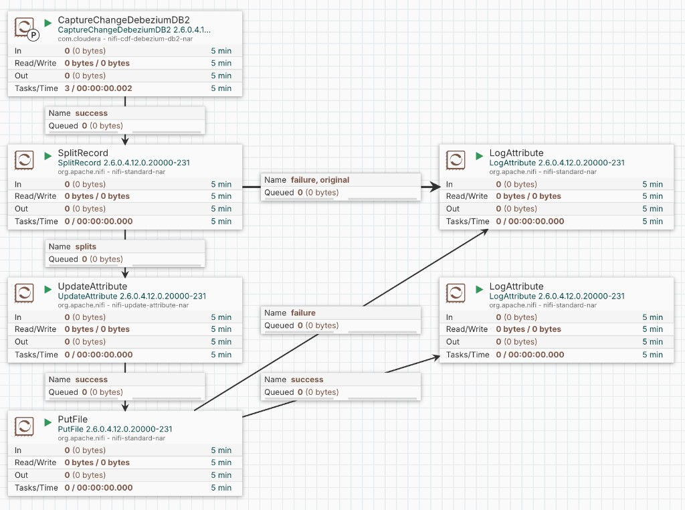

# CCSID 検証 — Step 1 CDC パイプライン検証

## 概要

スライド Step 1 に対応する **実検証** 手順です。

- **確認すること**: Debezium 経由の CDC 取得 + マルチバイト文字の UTF-8 保持 + INSERT/UPDATE/DELETE
- **確認しないこと**: 5035→939 等の z/OS CCSID 変換（Step 3）
- **フロー**: DB2 投入 → CaptureChangeDebeziumDB2 → SplitRecord → UpdateAttribute → PutFile → JSON 自動検証

---

## アーキテクチャ

```
┌─────────────────────────────────────────────────────────────┐
│ Cloudera on Cloud 環境（同一 VPC）                           │
│  Data Hub: Flow Management (NiFi クラスタ)                   │
│    CaptureChangeDebeziumDB2 → SplitRecord → UpdateAttribute │
│                              → PutFile (JSON 出力)           │
└───────────────────────────┬─────────────────────────────────┘
                            │ JDBC / TCP 50000
                            ▼
┌─────────────────────────────────────────────────────────────┐
│ EC2（DB2 ホスト）                                            │
│  Docker: icr.io/db2_community/db2 (LUW 11.5.8.0)            │
│    コンテナ名 db2_ebcdic / DB TESTDB / ASN CDC (asncap)      │
└─────────────────────────────────────────────────────────────┘
```

---

## 前提条件

本テスト環境は以下が **構築済み** であることを前提とします。

| 項目 | 内容 |
|---|---|
| Cloudera on Cloud | 環境（Environment）が作成済み |
| Data Hub | **Flow Management** クラスタがデプロイ済み（NiFi UI にアクセス可能） |
| EC2 | Cloudera 環境と **同一 VPC** 内に配置済み |
| ネットワーク | NiFi ノード → EC2 **TCP 50000** が到達可能（SG / NACL） |

---

## EC2 仕様（本テスト環境）

DB2 Community Edition Docker を動かすための EC2 構成です。

| 項目 | 値 |
|---|---|
| **OS** | Amazon Linux 2023（64-bit） |
| **インスタンスタイプ** | `m5.xlarge`（4 vCPU / 16 GiB メモリ） |
| **ルート EBS** | 100 GiB `gp3` |
| **追加 EBS（任意）** | 50 GiB `gp3` を `/data` にマウント（DB2 永続化用） |
| **セキュリティグループ（インバウンド）** | TCP **50000** ← NiFi ノードの SG / サブネット |
| **プライベート IP（例）** | `10.10.2.74` |
| **SSH ユーザー** | `ec2-user` |

> **補足**: DB2 Community Edition は **最大 4 CPU / 16 GiB メモリ** まで利用可能です。`m5.xlarge` はこの上限に収まる PoC 向けサイズです。IBM 公式の Docker 最小要件は RAM 4 GiB 以上・ディスク 20 GiB 以上ですが、イメージ展開と ASN CDC ログを考慮し **100 GiB** を推奨しています。

---

## 1. EC2 環境構築（Docker インストール〜 DB2 CDC 準備）

### 1-1. EC2 に SSH ログイン

```bash
ssh -i <your-key.pem> ec2-user@10.10.2.74
```

### 1-2. Docker のインストール（Amazon Linux 2023）

```bash
sudo dnf update -y
sudo dnf install -y docker git
sudo systemctl enable --now docker
sudo usermod -aG docker ec2-user

# グループ反映のため一度ログアウトして再ログイン
exit
ssh -i <your-key.pem> ec2-user@10.10.2.74

docker --version
```

Amazon Linux 2 の場合:

```bash
sudo yum update -y
sudo amazon-linux-extras install docker -y
sudo systemctl enable --now docker
sudo usermod -aG docker ec2-user
```

### 1-3. DB2 Community Edition コンテナの起動

```bash
# 永続ボリューム用ディレクトリ（EBS マウント先を推奨）
sudo mkdir -p /data/db2
sudo chown ec2-user:ec2-user /data/db2

docker pull icr.io/db2_community/db2:11.5.8.0

docker run -d \
  --name db2_ebcdic \
  --privileged \
  --restart unless-stopped \
  --shm-size=2g \
  --ipc=host \
  -p 50000:50000 \
  -e LICENSE=accept \
  -e DB2INSTANCE=db2inst1 \
  -e DB2INST1_PASSWORD='ChangeMe_StrongPass!' \
  -e DBNAME=TESTDB \
  -e TO_CREATE_SAMPLEDB=false \
  -v /data/db2:/database \
  icr.io/db2_community/db2:11.5.8.0
```

起動完了まで **10〜20 分** かかることがあります。

```bash
# ログ確認（"Setup has completed." が出れば OK）
docker logs -f db2_ebcdic

# ポート確認
docker port db2_ebcdic
# 0.0.0.0:50000->50000/tcp
```

### 1-4. Debezium 用 ASN CDC（UDF / asncap）のセットアップ

CaptureChangeDebeziumDB2 を動かすには、Debezium 公式の ASN CDC UDF が必要です。

#### (a) セットアップファイルを EC2 で取得しコンテナへコピー

```bash
cd /tmp
git clone --depth 1 https://github.com/debezium/debezium-connector-db2.git

docker exec db2_ebcdic mkdir -p /home/db2inst1/asncdctools/src
docker cp /tmp/debezium-db2/src/test/docker/db2-cdc-docker/. \
  db2_ebcdic:/home/db2inst1/asncdctools/src/

docker exec db2_ebcdic ls -la /home/db2inst1/asncdctools/src/
# asncdc.c, asncdc_UDF.sql, asncdctables.sql, asncdcaddremove.sql, dbsetup.sh
```

#### (b) UDF コンパイルと ASNCDC スキーマ作成

```bash
docker exec -it db2_ebcdic bash -c "su - db2inst1"
```

コンテナ内（`db2inst1`）:

```bash
cd ~/asncdctools/src

# C UDF コンパイル
/opt/ibm/db2/V11.5/samples/c/bldrtn asncdc

db2 connect to TESTDB

# JDBC メタデータ読み取り用 bind
cd $HOME/sqllib/bnd
db2 bind db2schema.bnd blocking all grant public sqlerror continue

# CDC 有効化に必要な backup / restart
db2 backup db TESTDB to /dev/null
db2 restart db TESTDB
db2 connect to TESTDB

# UDF バイナリ配置
cp ~/asncdctools/src/asncdc $HOME/sqllib/function/
chmod 755 $HOME/sqllib/function/asncdc

# ASNCDC スキーマ・管理 UDF・ADDTABLE/REMOVETABLE 作成
cd ~/asncdctools/src
db2 "CREATE SCHEMA ASNCDC AUTHORIZATION DB2INST1"   # 既存ならスキップ
db2 -tvmf asncdc_UDF.sql
db2 -tvmf asncdctables.sql
db2 -tvmf asncdcaddremove.sql
```

> **代替**: `dbsetup.sh TESTDB` を実行しても同様のセットアップが可能です（Debezium 公式 Docker テスト用スクリプト）。

#### (c) ASN Capture エージェント（asncap）の起動

```sql
CONNECT TO TESTDB;

-- UDF 動作確認（status が返れば OK）
VALUES ASNCDC.ASNCDCSERVICES('status','asncdc');

-- エージェント起動
VALUES ASNCDC.ASNCDCSERVICES('start','asncdc');
```

`asncap is running` またはステータス応答が返れば成功です。

#### (d) テストテーブル作成 + CDC 登録

本リポジトリの検証スクリプトで **冪等に実行** できます（推奨）:

```bash
git clone <this-repo> ~/ccsid-test
cd ~/ccsid-test
chmod +x run_step1_on_ec2.sh
MODE=setup ./run_step1_on_ec2.sh
```

手動で行う場合（`sql/01_create_table.sql` 参照）:

```sql
CONNECT TO TESTDB;

CALL ASNCDC.REMOVETABLE('DB2INST1', 'CCSID_TEST');
DROP TABLE IF EXISTS DB2INST1.CCSID_TEST;

CREATE TABLE DB2INST1.CCSID_TEST (
    ID          INT NOT NULL PRIMARY KEY,
    REGION      VARCHAR(10),
    NAME_COL    VARCHAR(100),
    PROBLEM_COL VARCHAR(500)
);

CALL ASNCDC.ADDTABLE('DB2INST1', 'CCSID_TEST');
VALUES ASNCDC.ASNCDCSERVICES('reinit','asncdc');

-- LUW では IBMSNAP_REGISTER で CDC 登録を確認
SELECT SOURCE_OWNER, SOURCE_TABLE, CD_OWNER, CD_TABLE
FROM ASNCDC.IBMSNAP_REGISTER
WHERE SOURCE_OWNER = 'DB2INST1' AND SOURCE_TABLE = 'CCSID_TEST';
```

### 1-5. NiFi からの接続確認（EC2 側）

```bash
# EC2 上でポート待受確認
ss -lntp | grep 50000

# NiFi ノード上で（別 SSH セッション）
nc -zv 10.10.2.74 50000
```

---

## 2. NiFi 環境構築（Flow Management）

Cloudera on Cloud の Data Hub **Flow Management** NiFi UI で以下を設定します。

### 2-1. DB2 JDBC ドライバの配置（インポート前の前提）

CaptureChangeDebeziumDB2 は IBM JCC ドライバが必要です。**NiFi クラスタの全ノード** に同じパスで配置してください。

```bash
# EC2 の DB2 コンテナから JAR を取得（例）
docker cp db2_ebcdic:/database/config/db2inst1/sqllib/java/db2jcc4.jar /tmp/

# 各 NiFi ノードへ配置（パスは環境に合わせる）
# 例: /opt/nifi/drivers/db2jcc4.jar
sudo mkdir -p /opt/nifi/drivers
sudo cp /tmp/db2jcc4.jar /opt/nifi/drivers/
sudo chown nifi:nifi /opt/nifi/drivers/db2jcc4.jar
```

> Data Hub では SSH 経由で各 NiFi ノードにログインし、**全ノード同一パス** に配置する必要があります。

### 2-2. フローテンプレートのインポート（推奨）

リポジトリ直下の **`ccsid-test.json`** に、本テスト用 NiFi プロセスグループ定義が含まれています。

**含まれる構成**

```
CaptureChangeDebeziumDB2 → SplitRecord → UpdateAttribute → PutFile
                              └ failure/original → LogAttribute（デバッグ用）
```

**NiFi DataFlow（本テスト環境）**



| 接続元 | Relationship | 接続先 |
|---|---|---|
| CaptureChangeDebeziumDB2 | success | SplitRecord |
| SplitRecord | splits | UpdateAttribute |
| SplitRecord | failure / original | LogAttribute |
| UpdateAttribute | success | PutFile |
| PutFile | success / failure | LogAttribute |

| 種別 | 名前 |
|---|---|
| プロセスグループ | `ccsid-test` |
| プロセッサ | CaptureChangeDebeziumDB2, SplitRecord, UpdateAttribute, PutFile, LogAttribute |
| Controller Service | EmbeddedHazelcastCacheManager, HazelcastMapCacheClient, JsonTreeReader, JsonRecordSetWriter |

**インポート手順**

1. NiFi UI を開く（Data Hub → Flow Management → NiFi）
2. キャンバス上で右クリック → **Upload**（または JSON ファイルをキャンバスへドラッグ＆ドrop）
3. `ccsid-test.json` を選択してアップロード
4. インポートされたプロセスグループ **`ccsid-test`** を開く

### 2-3. インポート後の環境依存設定

テンプレートは PoC 環境の値が入っています。デプロイ先に合わせて以下を確認・変更してください。

| 対象 | プロパティ | テンプレート値 | 変更が必要な場合 |
|---|---|---|---|
| CaptureChangeDebeziumDB2 | Host | `10.10.2.74` | EC2 のプライベート IP |
| CaptureChangeDebeziumDB2 | Password | （未設定） | **必須**: DB2 パスワードを入力 |
| CaptureChangeDebeziumDB2 | DB2 Driver Location(s) | `/opt/nifi/drivers/db2jcc4.jar` | JAR 配置パスが異なる場合 |
| PutFile | Directory | `/tmp/cdc-output` | NiFi ノード上の書き込み可能パス |
| UpdateAttribute | filename | `${UUID()}.json` | 通常は変更不要 |

**Controller Services の Enable 順序**

1. EmbeddedHazelcastCacheManager
2. HazelcastMapCacheClient
3. JsonTreeReader / JsonRecordSetWriter

**プロセッサの Start 順序**

1. Controller Services をすべて Enable
2. プロセスグループ内のプロセッサを Start（CaptureChangeDebeziumDB2 は Primary Node Only / 1 min）

### 2-4. 手動構築（参考）

テンプレートを使わず手動で構築する場合は、以下の設定を参考にしてください。

#### Controller Services の作成と有効化

NiFi UI → **Controller Settings（歯車）** → **Controller Services** タブ

#### (1) EmbeddedHazelcastCacheManager

| プロパティ | 値 |
|---|---|
| Hazelcast Clustering Strategy | **All Nodes** |

#### (2) HazelcastMapCacheClient

| プロパティ | 値 |
|---|---|
| Hazelcast Cache Manager | 上記 EmbeddedHazelcastCacheManager |
| Hazelcast Cache Name | `debezium-db2-history`（任意） |

#### (3) JsonTreeReader（SplitRecord 用）

| プロパティ | 値 |
|---|---|
| Schema Access Strategy | **Infer Schema** |

#### (4) JsonRecordSetWriter（SplitRecord 用）

| プロパティ | 値 |
|---|---|
| Schema Access Strategy | **Infer Schema** |

**Enable の順序**: EmbeddedHazelcastCacheManager → HazelcastMapCacheClient → JsonTreeReader / JsonRecordSetWriter

#### データフローの作成

NiFi キャンバス上に以下のプロセッサを配置し、接続します。

```
CaptureChangeDebeziumDB2
  → SplitRecord
  → UpdateAttribute
  → PutFile
```

| 接続元 | Relationship | 接続先 |
|---|---|---|
| CaptureChangeDebeziumDB2 | success | SplitRecord |
| SplitRecord | splits | UpdateAttribute |
| UpdateAttribute | success | PutFile |

#### CaptureChangeDebeziumDB2 の設定

| プロパティ | 設定値 | 備考 |
|---|---|---|
| **Host** | `10.10.2.74` | EC2 の **プライベート IP**（NiFi から到達できるアドレス） |
| **Port** | `50000` | Docker ポートマップ |
| **Database Name** | `TESTDB` | |
| **Username** | `db2inst1` | |
| **Password** | `<DB2 パスワード>` | `DB2INST1_PASSWORD` で設定した値 |
| **DB2 Driver Class Name** | `com.ibm.db2.jcc.DB2Driver` | デフォルト |
| **DB2 Driver Location(s)** | `/opt/nifi/drivers/db2jcc4.jar` | **全 NiFi ノード** に配置したパス |
| **Database History Cache Service** | HazelcastMapCacheClient | 2-2 で作成 |
| **Schema Include List** | `DB2INST1` | 推奨 |
| **Table Include List** | `DB2INST1\.CCSID_TEST` | 正規表現（`.` はエスケープ） |
| **Output Record Format** | **Whole** | `{schema, payload}` 形式 |

**Dynamic Properties（「+」から追加）**

| Name | Value |
|---|---|
| `database.server.name` | `db2test` |
| `database.cdcschema` | `ASNCDC` |
| `snapshot.mode` | `initial`（初回のみ。2 回目以降は `when_not_needed` も可） |

**Scheduling**

| 項目 | PoC 用 | 本番想定 |
|---|---|---|
| Scheduling Strategy | Timer Driven | Timer Driven |
| Run Schedule | **1 min** | **30 min** |
| Execution | **Primary Node Only** | **Primary Node Only** |
| Concurrent Tasks | 1 | 1 |

**State Management**: State Scope = **Cluster**

> **重要**: Primary Node Only は必須です。複数ノードで同時実行すると Debezium オフセットが重複します。

#### SplitRecord の設定

| プロパティ | 値 |
|---|---|
| Record Reader | JsonTreeReader |
| Record Writer | JsonRecordSetWriter |
| Records Per Split | `1` |

CaptureChangeDebeziumDB2 は 1 FlowFile に複数 CDC イベントをまとめるため、**1 レコード = 1 FlowFile** に分割する必要があります。

#### UpdateAttribute の設定

PutFile は **`filename` プロパティを持ちません**。FlowFile 属性 `filename` で保存名を決めます。

| プロパティ | 値 |
|---|---|
| **filename** | `${UUID()}.json` |

> PutFile の Properties に `filename` を追加すると **Validation Error** になります。必ず UpdateAttribute で設定してください。

#### PutFile の設定

| プロパティ | 値 |
|---|---|
| **Directory** | `/tmp/cdc-output`（NiFi ノード上の書き込み可能パス） |
| **Conflict Resolution Strategy** | `fail` / `ignore` / `replace`（`${UUID()}.json` 使用時は `replace` も可） |
| **Create Missing Directories** | `true` |

> UpdateAttribute で `${UUID()}.json` を設定していればファイル名はユニークです。固定ファイル名のまま `replace` にすると最後の 1 件だけ残り、検証が失敗します。

### 2-5. フロー起動と動作確認

1. Controller Services をすべて **Enable**
2. プロセッサを **Start**
3. EC2 で DML 投入:

```bash
cd ~/ccsid-test
MODE=dml ./run_step1_on_ec2.sh
```

4. 1〜2 分待ち、PutFile 出力を確認:

```bash
# NiFi ノード上
ls /tmp/cdc-output/ | wc -l   # 複数ファイルあること
```

5. JSON の `payload.after` / `payload.before` にマルチバイト文字が正しく入っているか確認

---

## クイックスタート（EC2）

```bash
cd ~/ccsid-test
chmod +x run_step1_on_ec2.sh

# 1. 初回のみ: テーブル作成 + CDC 有効化
MODE=setup ./run_step1_on_ec2.sh

# 2. テストデータ投入
MODE=dml ./run_step1_on_ec2.sh

# 3. NiFi スナップショット（op:r）取得後、9100 の c/u/d 用 DML
MODE=dml9100 ./run_step1_on_ec2.sh

# 4. PutFile 出力を検証
PUTFILE_DIR=/tmp/cdc-output MODE=verify ./run_step1_on_ec2.sh

# 5. 結果確認
cat results/step1_results.md
```

### 推奨ワークフロー

```
1. MODE=setup
2. MODE=dml（9001-9006 + 9100）
3. NiFi Start → cdc-output に 6 件（op:r スナップショット）を確認
4. MODE=dml9100（9100 のみ、スナップショット完了後）
5. PUTFILE_DIR=cdc-output MODE=verify
```

### DML の再実行

`MODE=dml` / `MODE=dml9100` は **冪等** です。データが既にあってもなくても同じコマンドで完了します。

- 9001–9006: 一旦 DELETE → INSERT し直し
- 9100: DELETE（行なし OK）→ INSERT → UPDATE → DELETE

### 分割実行（NiFi 待ちを手動で行う場合）

```bash
# A. DB2 へテストデータ投入
MODE=dml ./run_step1_on_ec2.sh

# B. NiFi が 1〜2 分で JSON を出力するのを待つ

# C. PutFile JSON を検証
PUTFILE_DIR=/path/to/cdc-output MODE=verify ./run_step1_on_ec2.sh
```

---

## PutFile ディレクトリの取得方法

PutFile は NiFi ノード上に出力されます。EC2（DB2 ホスト）から直接見えない場合:

```bash
# NiFi ノードから EC2 へ JSON をコピー（例）
scp nifi-node:/tmp/cdc-output/*.json ./cdc-output/

# ローカルコピーで検証
python3 step1_cdc_verify.py --mode verify --putfile-dir ./cdc-output
```

---

## 検証内容

| ID | 内容 |
|---|---|
| REG-JPN 〜 REG-USA | 6 リージョン相当マルチバイト INSERT (op:r / op:c) |
| DML-INS | ID=9100 INSERT (op:c) |
| DML-UPD | ID=9100 UPDATE (op:u) |
| DML-DEL | ID=9100 物理 DELETE (op:d) |

---

## リポジトリ構成

| ファイル / ディレクトリ | 用途 |
|---|---|
| `ccsid-test.json` | NiFi フローテンプレート（プロセスグループ `ccsid-test`） |
| `images/nifi-dataflow.png` | NiFi DataFlow キャプチャ（README 参照用） |
| `step1_cdc_verify.py` | DML 投入 + PutFile JSON 検証スクリプト |
| `run_step1_on_ec2.sh` | EC2 向け実行ラッパー |
| `sql/` | テーブル作成・DML 用 SQL（参考） |
| `fixtures/` | 検証用サンプル JSON |
| `results/` | 検証結果出力 |

## 出力ファイル

| ファイル | 用途 |
|---|---|
| `results/step1_results.json` | 機械可読な全結果 |
| `results/step1_results.md` | スライド転記用 Markdown |

---

## SQL ファイル

| ファイル | 用途 |
|---|---|
| `sql/01_create_table.sql` | テーブル作成 + ADDTABLE + reinit |
| `sql/02_seed_regions.sql` | 6 リージョン相当データ（ID 9001-9006） |
| `sql/03_dml_cdc_test.sql` | INSERT/UPDATE/DELETE（ID 9100） |

---

## トラブルシューティング

| 症状 | 原因 / 対処 |
|---|---|
| `ASNCDC.ASNCDCSERVICES` が存在しない | 1-4 の UDF セットアップ未完了。`bldrtn` と SQL スクリプトを再実行 |
| `asncap is not running` | `VALUES ASNCDC.ASNCDCSERVICES('start','asncdc')` を実行 |
| NiFi から DB2 接続不可 | SG で NiFi → EC2:50000 を許可。Host に `localhost` ではなく EC2 プライベート IP を指定 |
| PutFile に 1 ファイルしかない | SplitRecord（Records Per Split=1）と UpdateAttribute（`${UUID()}.json`）を確認 |
| PutFile に `filename` Validation Error | PutFile ではなく **UpdateAttribute** で `filename` を設定 |
| verify が 9100 だけ WAIT | スナップショット完了後に `MODE=dml9100` を実行し 1〜2 分待って再 verify |
| `SQL0803N` 主キー重複 | `MODE=dml` を再実行（冪等ロジックで自動リカバリ） |

---

## 参考リンク

- [Debezium DB2 Connector ドキュメント](https://debezium.io/documentation/reference/stable/connectors/db2.html)
- [Debezium DB2 Docker テスト用 Dockerfile / スクリプト](https://github.com/debezium/debezium-connector-db2/tree/main/src/test/docker/db2-cdc-docker)
- [IBM DB2 Community Edition for Docker](https://www.ibm.com/docs/en/db2/12.1.x?topic=deployments-db2-community-edition-docker)
